# Lab 3 - Deploy Cloud Native App

Duration: 60 mins

## Goals:
- Users will pick a redis DB and get the connection details and credentials
- Install Redis Insight and connect to the DB
- Install AWS Ingress Controller - AWS Loadbalancer Controller
- Deply various banks apps and review 

This is the fun part. Biggest section of our labs. This is where we will deploy the cloud native bank app.

In the sheet that is made available, please pick the DB connection string, port, and password details against your student #


	
  To create monolith bank application, please use [this](https://github.com/Redislabs-Solution-Architects/redisbank) repo.
  
  To create images and push them into container registry, you will see the steps in [this](https://github.com/Redislabs-Solution-Architects/redisbank-microservices) git repo.

  In the interest of time, I have already created the images and moved them to ECR. We will directly use those images in our manifest files and deploy applications in our EKS cluster.

  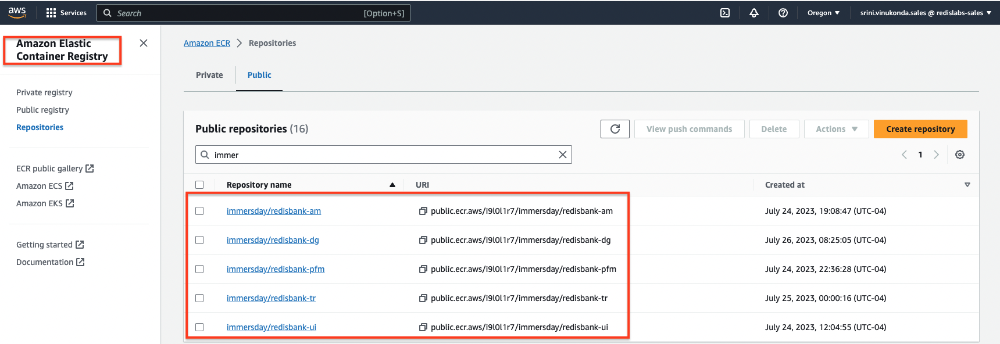

Lets review the mainfest files.


## Deploy AWS Ingress Controller
1. Create IAM Policy
    ```
    curl -O https://raw.githubusercontent.com/kubernetes-sigs/aws-load-balancer-controller/v2.5.4/docs/install/iam_policy.json

     aws iam create-policy \
    --policy-name AWSLoadBalancerControllerIAMPolicy \
    --policy-document file://iam_policy.json
    ```

You can see the policy on the web console also.

2. You can use eksctl or the AWS CLI and kubectl to create the IAM role and Kubernetes service account. For this you need to associate an OIDC provided with the cluster. Lets do that first.

  ```
  export cluster_name=<your cluster name>
  oidc_id=$(aws eks describe-cluster --name $cluster_name --query "cluster.identity.oidc.issuer" --output text | cut -d '/' -f 5)
  eksctl utils associate-iam-oidc-provider --cluster $cluster_name --approve
  ```

3. Now create the IAM role. Change the ARN of the policy to your ARN. You can get this from web console also under IAM.   This will take 1-2 minutes.
Please edit cluster name  with your cluster name

  
  


  ```
  eksctl create iamserviceaccount \
  --cluster=<your cluster name> \
  --namespace=kube-system \
  --name=aws-load-balancer-controller \
  --role-name AmazonEKSLoadBalancerControllerRole \
  --attach-policy-arn=<your policy ARN> \
  --approve
  ```
4. Helm update before installing the AWS ingress controller
```
helm repo add eks https://aws.github.io/eks-charts
helm repo update eks
```

5. Install controller. Please edit cluster name  with your cluster name
```
helm install aws-load-balancer-controller eks/aws-load-balancer-controller \
  -n kube-system \
  --set clusterName=<Your cluster Name> \
  --set serviceAccount.create=false \
  --set serviceAccount.name=aws-load-balancer-controller
```

6. You will see output like this 

```
NAME: aws-load-balancer-controller
LAST DEPLOYED: Tue Aug 15 15:43:34 2023
NAMESPACE: kube-system
STATUS: deployed
REVISION: 1
TEST SUITE: None
NOTES:
AWS Load Balancer controller installed!
```

7. Validate to see you get the below output
```
kubectl get deployment -n kube-system aws-load-balancer-controller
```
```
NAME                           READY   UP-TO-DATE   AVAILABLE   AGE
aws-load-balancer-controller   2/2     2            2           2m54s
```

## Install Redis Insight on your local machine and connect to your redis database

1. Click [here]https://redis.com/redis-enterprise/redis-insight/?_gl=1*aje5kw*_ga*ODYwNTY3NjQ3LjE2ODk2ODkxODI.*_ga_8BKGRQKRPV*MTY5MzUwODcyNC45LjAuMTY5MzUwODcyNi41OC4wLjA.&_ga=2.74644438.515136232.1693508725-860567647.1689689182#insight-form) to get to the download page.

2. Pick the appropriate operating system from the dropdown and complete the form. Click on Download

  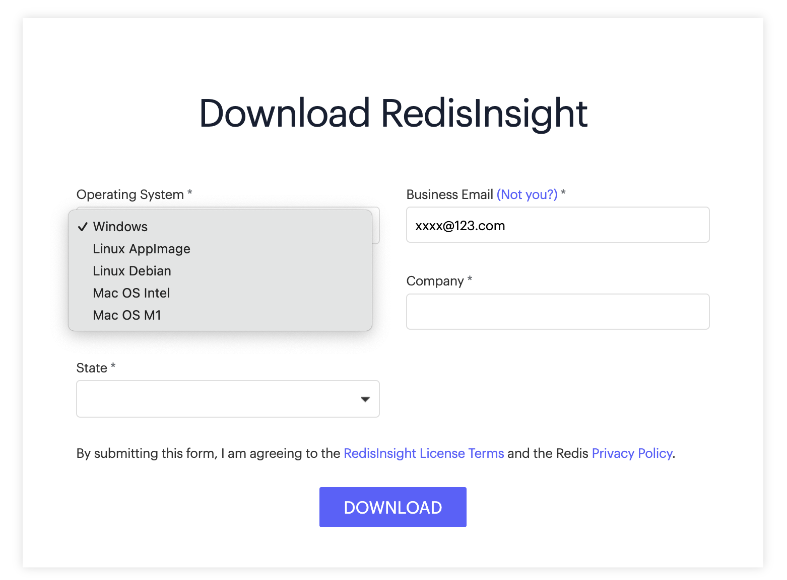

3. Complete the installation process. 

4. Connect to your redis database

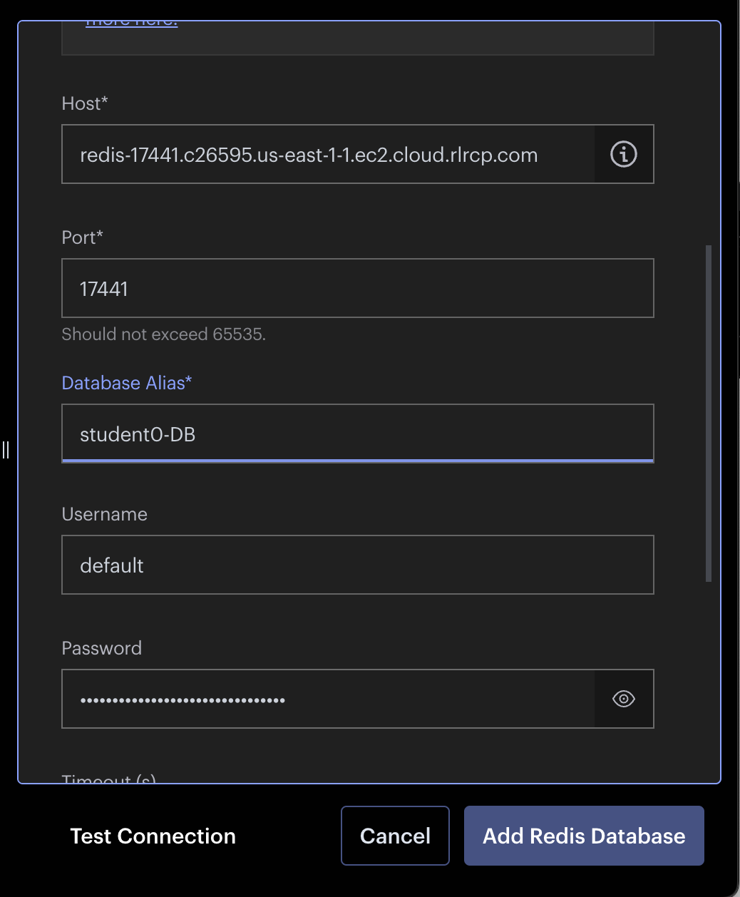
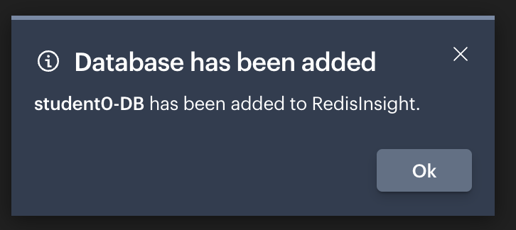
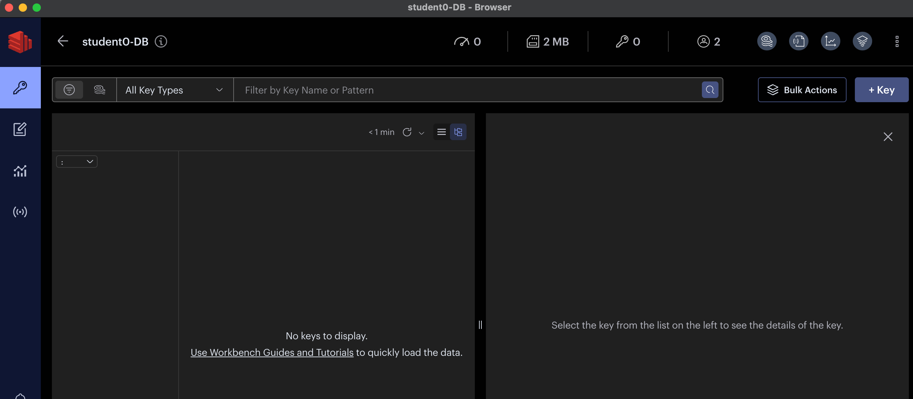


## Deploy data generator app 

1. Connect to your redis database using  Redis Insight
2. Edit the dg yaml for deployment with the host, port, and password provided. Deploy using dg-manifest.yaml. Review the deployment.

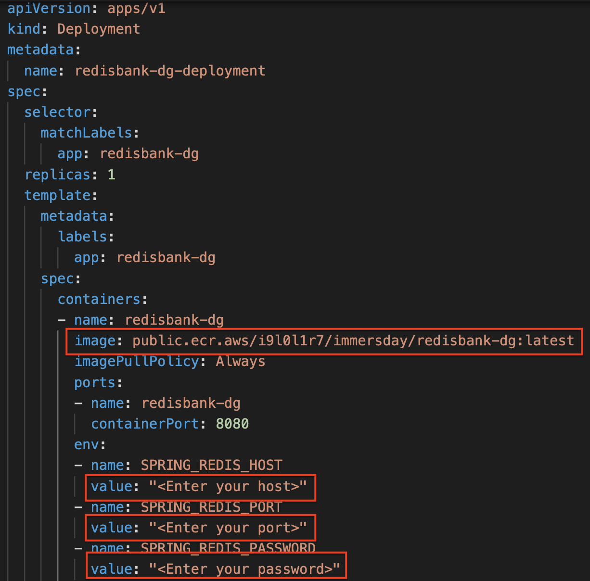


```
kubectl apply -f dg-manifest.yaml
```
```
kubectl get deploy
```


3. If the deplyment is successful, you will see data flowing into the database from Redis Insight.


## Deploy the ui app

1. Edit the ui app deployment and ingress yamls with the DB host, port, password, and student number. 
Deploy using ui-manifest.yaml. Review the deployment, ingress, and service using ui-manifest.yaml. 
Review the deployment.


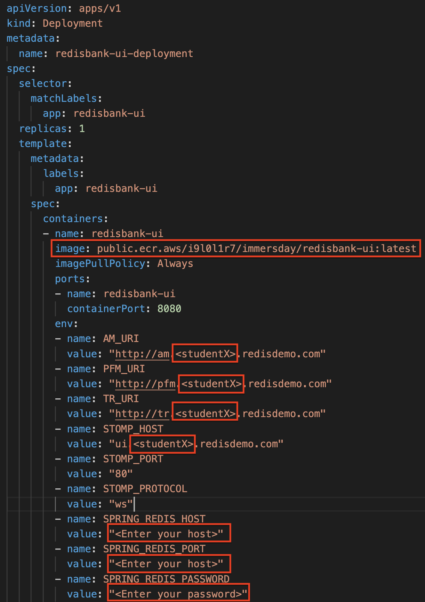


```
kubectl apply -f ui-manifest.yaml
```
```
kubectl get deploy,ing,svc,po
```

2. Once the ingress is deployed, add the ALB and your region details to the shared google doc.

3. Once DNS is set up, you can hit the site and validate.

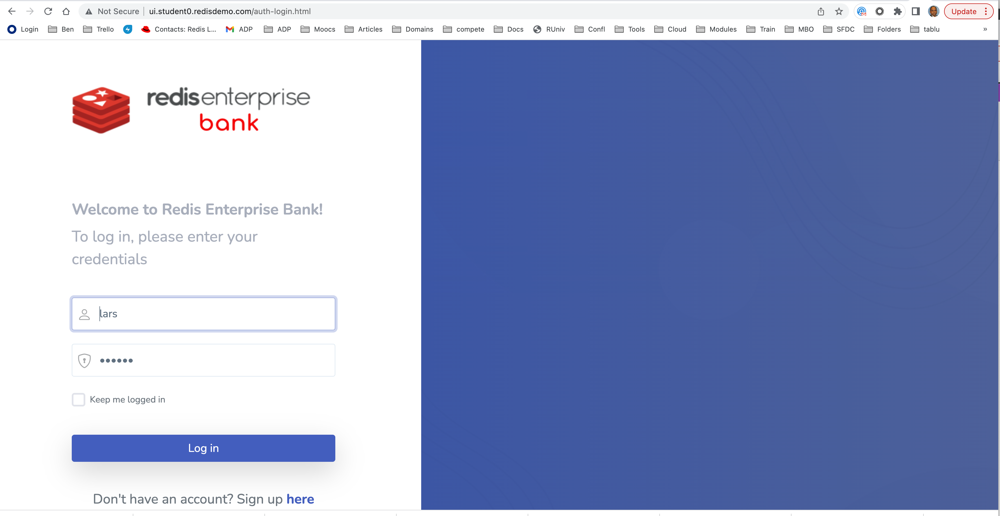


## Deploy the am and pfm apps

1. Edit the am, pfm app deployment and ingress yamls with the DB host, port, password, and student number. Deploy using am-manifest.yaml, pfm-manifest.yaml. Review the deployment, ingress, and service


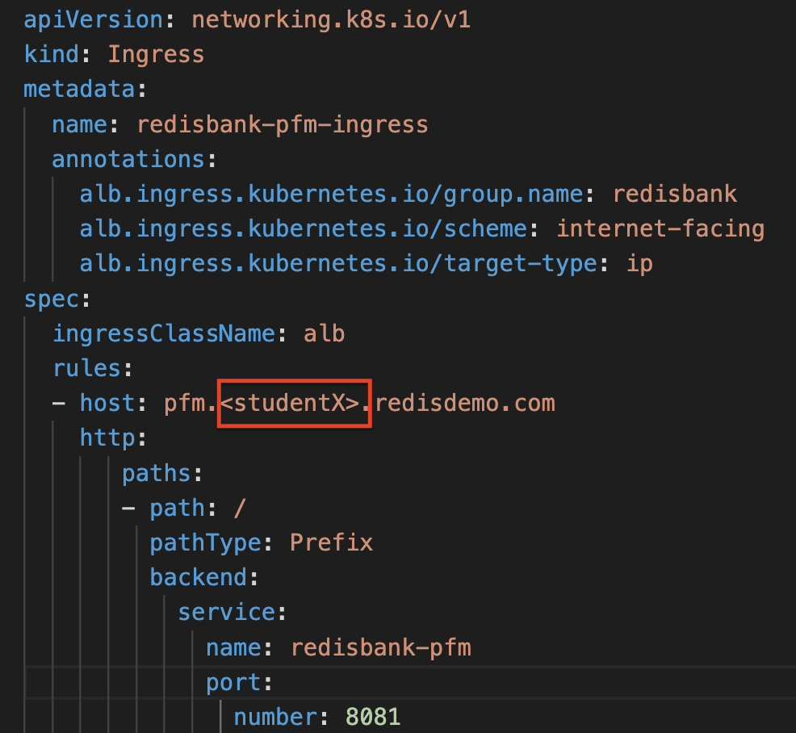


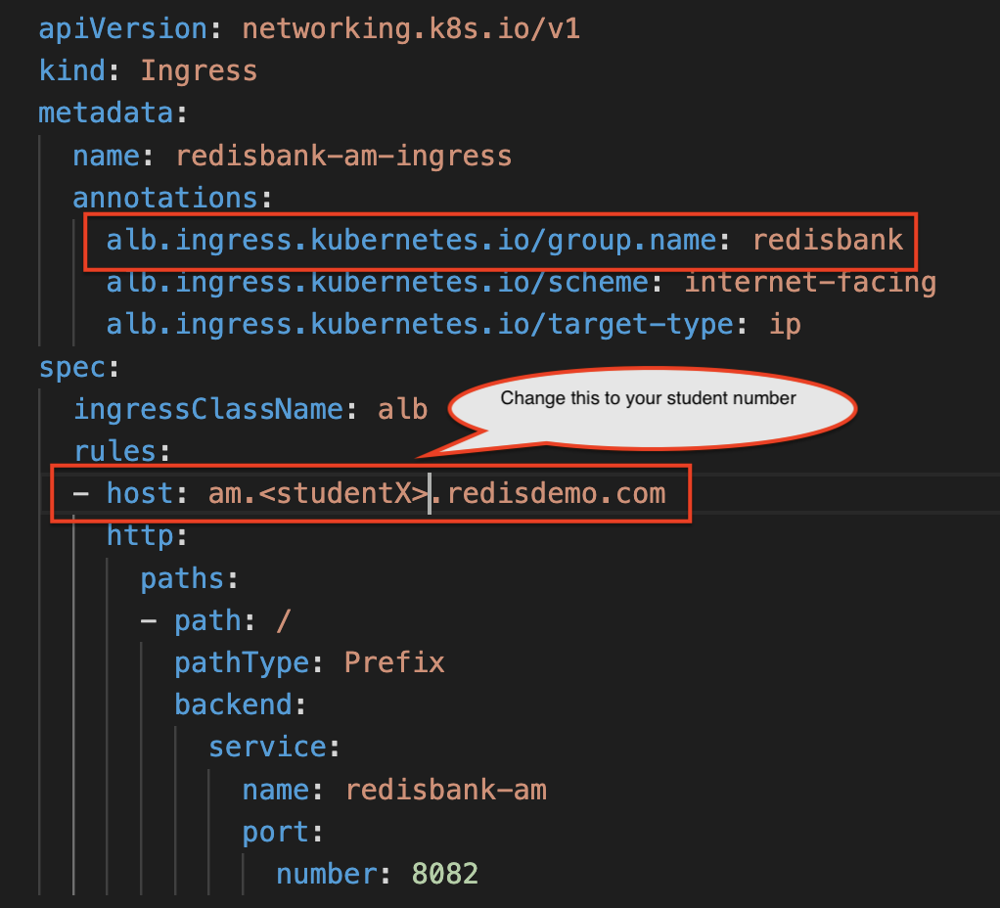

```
kubectl apply -f am-manifest.yaml
kubectl apply -f pfm-manifest.yaml
```
```
kubectl get deploy,ing,svc,po
```

2. Refreshing the web page should display charts 

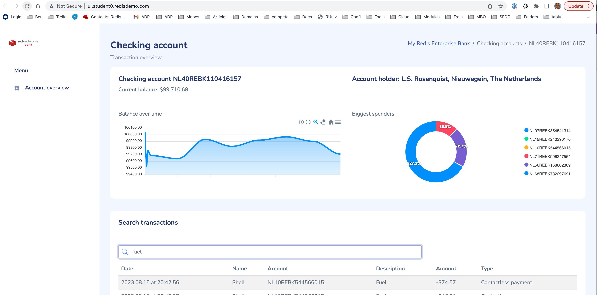

## Deploy the tr app

1. Edit the tr app deployment and ingress yamls with the DB host, port, password, and student number. Deploy using tr-manifest.yaml. Review the deployment, ingress, and service using tr-manifest.yaml. 

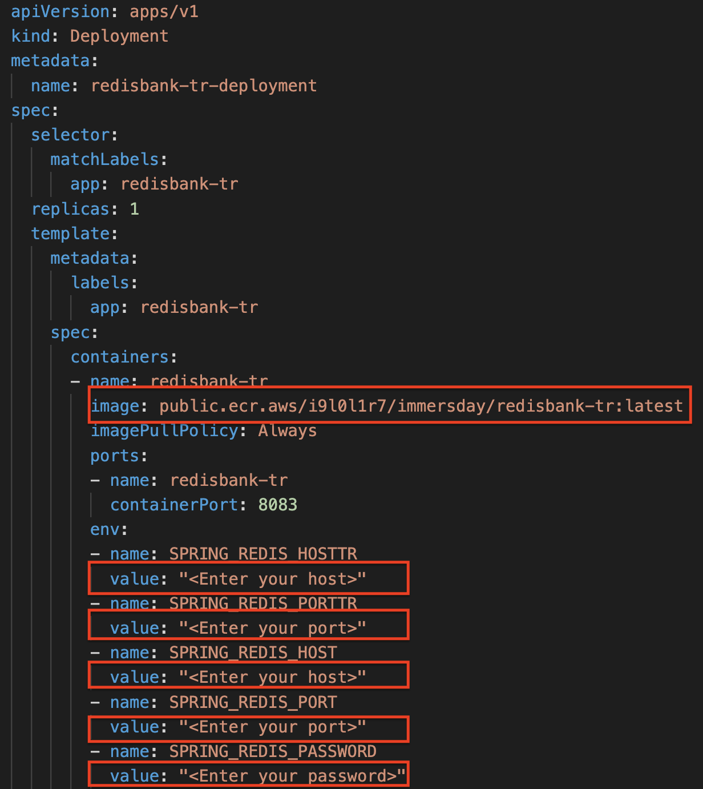
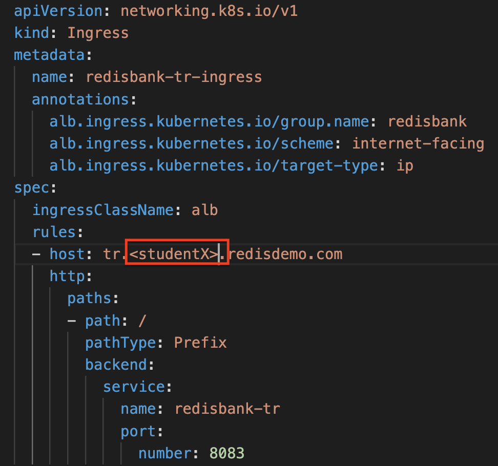


```
kubectl apply -f tr-manifest.yaml
```
```
kubectl get deploy,ing,svc,po
```

2. Validate search functionailty


In this lab, we have deployed a modern cloud native application in EKS cluster. We also learned how to install AWS ingress controller and route traffic to the appropriate services.

When ready continue to the next lab [Lab 4 - Cleanup](Lab%204%20-%20Cleanup)