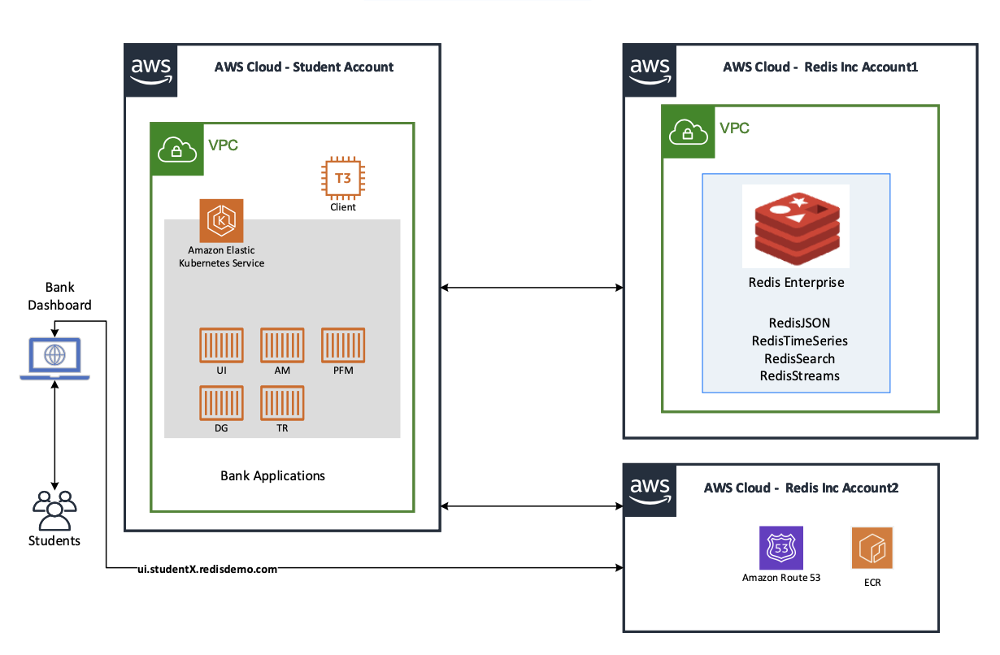

# hands-on-labs-cloud-native-modern-app

Redis Enterprise Cloud (RC) is a DBaaS (Database-as-a-Service) offering from Redis Inc, the home of RedisOSS. RC is built on top of Redis open source and adds support for other data models, like native JSON and search, graph, and timeseries.  In addition it has  enterprise features like Active-Active Geo replication, High Availability - guaranteeing upto 5 9's (99.999%) uptime and the ability to use tiered storage, Redis on Flash, all built in to our managed service.

Amazon Elastic Kubernetes Service (Amazon EKS) is a managed Kubernetes service to run Kubernetes in the AWS cloud and on-premises data centers. In the cloud, Amazon EKS automatically manages the availability and scalability of the Kubernetes control plane nodes responsible for scheduling containers, managing application availability, storing cluster data, and other key tasks. With Amazon EKS, you can take advantage of all the performance, scale, reliability, and availability of AWS infrastructure, as well as integrations with AWS networking and security services. On-premises, EKS provides a consistent, fully-supported Kubernetes solution with integrated tooling and simple deployment to AWS Outposts, virtual machines, or bare metal servers.

In this workshop, we will look at a monolithic bank application and then deploy the same application as a microservices based application inside an EKS cluster. We will leverage Redis Enterprise Cloud on AWS as the modern data store. This hands-on experience will serve as a great learning experience on how to build and deploy modern cloud-native real-time applications leveraging Redis Enterprise Cloud and AWS services.

## Venue
These hands-on workshops are designed for in-person and for virtual experiences.

## Duration
3.5 to 4 hours

## Prerequisites
These hands-on labs are targeted for Technical stakeholders like Application Developers, DevOps, Technical Leads and Architects. If you are not in any of the above mentioned roles, it would be a disservice for yourself to go any further beyond this point. But if you are one of those most curious souls who do not shy away from getting hands-dirty, we still welcome you to hop on the journey.

Here are few hard skills that you would want to bring to the table:
- Very comfortable with AWS web console, AWS CLI.
- Very comfortable running SSH terminal session in connecting to remote servers (ec2 machines)
- Very familiar with Docker, Containers, and k8s. 

You will also bring your own laptop / desktop with a browser. You will also bring your AWS account. But don't worry, AWS is giving credits that you can use to run these labs up until you exhaust these credits. We will also help you with cleanup scripts so that you do not get a surprise bill at the end. More on it in the labs.

## Lab Overview

## Agenda

* Introductions
  *	Introduction to Redis Enterprise Cloud
  * Customer Use Cases
  * Why customers love Redis

* [Demo - Deploying Redis Enterprise Cloud on AWS](https://docs.google.com/presentation/d/1-2aRQEQQ0LS97OGv2D_nIaoJK2w1-2XY/edit#slide=id.p11)
* [Lab 0 - Signup for AWS](Lab%200%20-%20Signup%20for%20AWS) 
  * Signup
  * Applying Credits

* Lecture - Why orgs modernize
  * Why modernize?

* [Lab 1 - EKS deployment from EC2](Lab%201%20-%20EKS%20Deploy%20from%20EC2)
  * Deploy EC2 and install utilities
  * Deploy EKS cluster
  
* Lecture - AWS Services for App Modernization
  * AWS Services

* [Lab 2 - Connect and Deploy a sample ppplication from EKS](Lab%202%20-%20Sample%20App%20in%20EKS)
  * Connect to EKS
  * Deploy a sample app and validate
  * Delete the sameple app

* [Lab 3 - Deploy Cloud Native Application](Lab%203%20-%20Deploy%20Cloud%20Native%20App)
  * Deploy AWS Ingress Controller
  * Deploy ui app and expose it as a service and deploy an ingress
  * Deploy the remaining applications 
  * Validate

* [Lab 4 - Cleanup](Lab%204%20-%20Cleanup)

* Conclusion and Next Steps